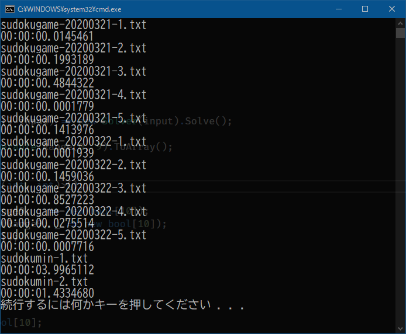

# Tools 2020
The project to create tools.

## Sudoku Solver
Sudoku Solver is a console app to solve sudoku (number place) problems.
The input is given as files.  
See [document](https://github.com/sakapon/Tools-2020/wiki/Sudoku-Solver).

## Thanks
### Test Data
- [数独無料ゲーム - 数独問題集](http://www.sudokugame.org/)
